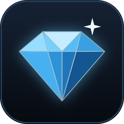
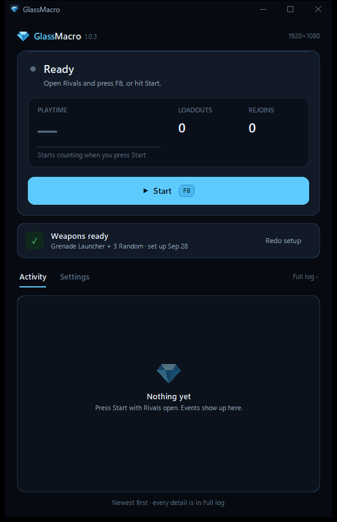

<p align="center">
  
</p>

<h1 align="center">GlassMacro</h1>

<p align="center">
  
</p>

## Why I made this

I wanted the **Glass wrap** in Rivals, and grinding FFA playtime by hand takes forever. I
tried TinyTask first, but it kept picking the wrong weapon, because the weapon grid moves
around whenever there's an event. So I built my own macro that actually *looks* at the
screen instead of clicking fixed spots.

It got me the wrap. I've left it running for 10+ hours straight, so now I'm sharing it.

## What it does

- **Picks your loadout.** Every time the weapon picker opens, it goes **Grenade Launcher**,
  then **Random** for the other 3 slots.
- **Keeps playing.** Between rounds it jumps and fires, so it respawns by itself and skips
  the end screens.
- **Gets back into games on its own:**
  - Sitting in the hub? It walks the menu into Free For All.
  - Stuck spectating? It presses Join.
  - Disconnected? It hits Reconnect, and if that doesn't work it restarts Roblox and rejoins.
- **Keeps Roblox fullscreen.** If Roblox ends up in a window, it presses F11 for you.
- **Pauses when you tab out.** It only does anything while Rivals is the window in front, so
  you can still use your PC and it won't mess with anything.

## What you need

- Windows 10 or 11
- A **1920×1080** screen. Other sizes aren't supported yet, and the app tells you if yours
  is different.
- Roblox Rivals, obviously

## Installing it

1. Go to **[Releases](../../releases/latest)** and download `GlassMacro-v1.0.3.zip`.
   Only get it from here, not from random re-uploads.
2. Right-click the zip → **Extract All**. Don't run it from inside the zip.
3. Open the folder and run **`GlassMacro.exe`**.

Windows will probably warn you the first time. That's normal, and the section
[If Windows or your antivirus warns you](#if-windows-or-your-antivirus-warns-you)
below explains what to do.

Your settings are saved in `%LOCALAPPDATA%\GlassMacro`. If you ever want it gone,
delete the GlassMacro folder and that one, and that's everything.

## Setting it up (like 30 seconds, one time)

The macro just needs to learn where your weapons are. Everything else is already set up.

1. In Rivals, open the **weapon picker**.
2. In GlassMacro, press **I'm on the weapon picker · start setup**. The app walks you
   through it one step at a time, with a little picture of what to hover.
3. Hover over each of these and press **F8**. Don't click, just hover.
   1. the **Random** tile
   2. the **Grenade Launcher** button itself
   3. your **first loadout slot** along the top

Messed up? Press **Esc** to cancel and start again. If an event ever adds or removes
weapons and the grid moves, hit **Redo setup** and do the same three hovers.

## Using it

- Press **Start**, or **F8** while you're in Rivals. **F8** again stops it.
- You can start it from anywhere: the hub, mid-match or spectating. It figures out where
  you are.
- The top card shows what it's doing right now. The dot pulses while it's working: green
  while it's playing, amber when it's paused or reconnecting.
- **Playtime** is the big number. It also shows how many loadouts it's picked and how many
  times it's rejoined, and it keeps your last run on screen after you stop.
- **Activity** lists what happened in plain English, newest first. **Full log** has every
  detail, which helps with bug reports.

In **Settings** you can:
- turn off **Keep Roblox fullscreen**, **Reconnect automatically** or **Save screenshots**
- run a **Live test** of the detection. Leave **Match sensitivity** at 0.82 unless picks
  get skipped.
- open the data folder, which has the log and the pictures it saves

## If Windows or your antivirus warns you

GlassMacro isn't code-signed, because that costs money every year. Windows is careful with
any new app that hasn't been signed. It doesn't mean something's wrong with it.

**"Windows protected your PC"**: click **More info**, check it says `GlassMacro.exe`,
then click **Run anyway**. That only allows this one file.

**Your browser says the file "isn't commonly downloaded"**: choose **Keep**. In Edge
it's **…** → **Keep** → **Show more** → **Keep anyway**.

**"Smart App Control blocked this app"**: this one has no Run anyway button. The only
way around it is turning Smart App Control off, which makes your PC less protected. That's
totally your call, and it's fine to skip GlassMacro instead.

**Your antivirus quarantines it**: don't restore it. Open an [issue](../../issues) with
the exact detection name and I'll get it reported as a false positive.

**Please never** turn off Defender or real-time protection, or add exclusions for whole
folders like Downloads, just to get a program running. GlassMacro doesn't need that, and
nothing you download ever should.

## Good to know

- **Use it at your own risk.** Macros can go against Roblox's or the game's rules, and your
  account is your responsibility.
- **I'm not affiliated with Roblox or Rivals.**
- **What it actually does on your PC:**
  - It looks at your screen to see what's showing, and only uses your keyboard and mouse
    inside Rivals.
  - It listens for F8 to start and stop, plus Esc during setup. It doesn't record anything
    else you type.
  - The only program it ever closes or reopens is Roblox.
  - Nothing gets sent anywhere. The pictures it saves stay in your data folder.

## Found a bug?

Open an [issue](../../issues) and tell me what happened. Attaching your `log.txt`
(Settings → **Open data folder**) helps a ton, and so do the pictures in the `events`
folder, since they show exactly what the macro saw.

## Building it yourself

If you'd rather build it from the code, you need Python 3.14 on Windows:

```powershell
python -m venv .venv
.\.venv\Scripts\python -m pip install -r requirements.txt
.\.venv\Scripts\pyinstaller --noconfirm --clean --onedir --windowed --noupx --name GlassMacro `
  --icon glassmacro.ico --add-data "glassmacro.ico;." --version-file version_info.txt glassmacro.py
```

The app ends up in `dist\GlassMacro\`. `python make_icon.py` redraws the icon.
`python test_detectors.py` checks the screen detection against real screenshots, which you
need to provide yourself because they aren't in the repo.

## License

[MIT](LICENSE). Do what you want with it, just keep the license file.
